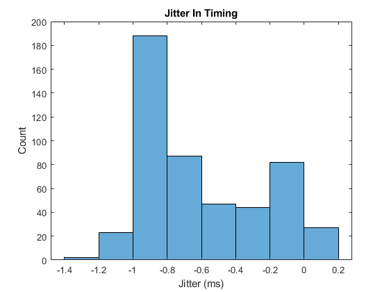
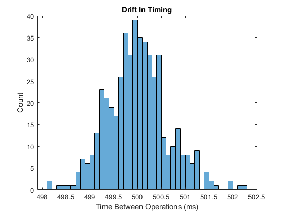

# Matlab Blocking Timer

[](https://uk.mathworks.com/matlabcentral/fileexchange/125290-high-performance-blocking-timer)

## Overview

Implements two functions, `getTime` and `waitUntilTime` which can be used for performance critical timing operations in MATLAB running under Windows. These provide high-performance timing with jitter / drift on the order of ~1 ms.

The functionality was inspired by the `GetSecs` and `WaitSecs('UntilTime')` functions in the [Psychtoolbox](http://psychtoolbox.org/) which offer similar performance, but require the `Psychtoolbox`.

:warning: `waitUntilTime` is a **blocking** timer. This means MATLAB will be unresponsive until the specified time is reached!

## Installation

The timer functions can be installed directly from the MATLAB Add-On Explorer. Select Add-Ons and search for Blocking Timer, then select Add, Add to MATLAB.

## Usage

The functions can be used to perform a task at a specified interval. To avoid drift between successive events, it is recommended to reference the wait times against a static start time.

```matlab
% set number of iterations and repetition interval in seconds
numIterations = 1000;
repetitionInterval = 0.5;

% get start time, and start loop
startTime = getTime();
for ind = 1:numIterations

    % wait until specified time
    waitUntilTime(startTime + ind * waitTime);

    % do something...

end
```

The `getTime` funciton can also be used as an alternative to `tic` / `toc` to implement precision timing.

```matlab
startTime = getTime;

% do something...

disp(['Elapsed time is ' num2str(getTime - startTime) ' seconds.']);
```

## Performance

Two test scripts are provided in the `examples` folder. The `testTimerJitter` script checks for the timing-jitter using 500 successive calls to `waitUntilTime`. The `testTimerDrift` script checks for drift between 500 successive events, where the desired time between events is 500 ms. Run under real-world conditions, the timing accuracy is around ~1 ms (see histograms below).

 

## Implementation

The functions use the C++ MEX API to implement the timing functions. The current time is calculated using the Windows `QueryPerformanceCounter`, which is a high resolution (<1us) time stamp. The blocking timer is implemented using the Windows multimedia timer API. This combination gave the best performance compared to using `std::chrono::high_resolution_clock::now()` to get the time, and `std::this_thread::sleep_for`, `Sleep`, or `CreateWaitableTimer` to implement the blocking timer.

## Compiling

Compiled versions of the `getTime.cpp` and `waitUntilTime.cpp` mex functions are included in the repository. These were compiled using Windows 10 with MATLAB 2022b and the Microsoft Visual C++ 2022 compiler.

To compile the codes, call:

```matlab
mex -lkernel32 -lwinmm -largeArrayDims waitUntilTime.cpp
mex -lkernel32 -largeArrayDims getTime.cpp
```
